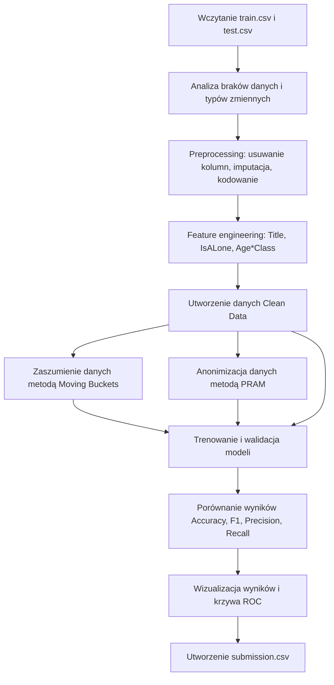
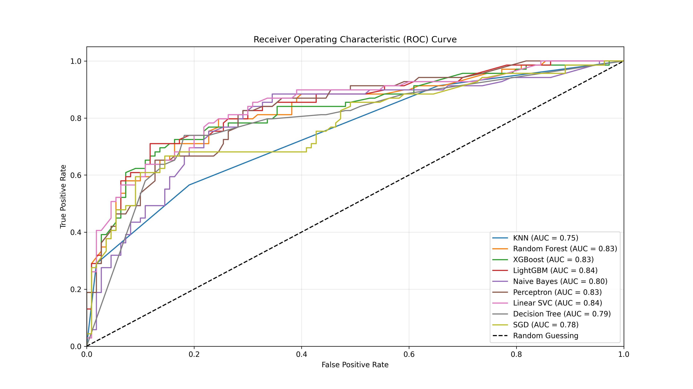
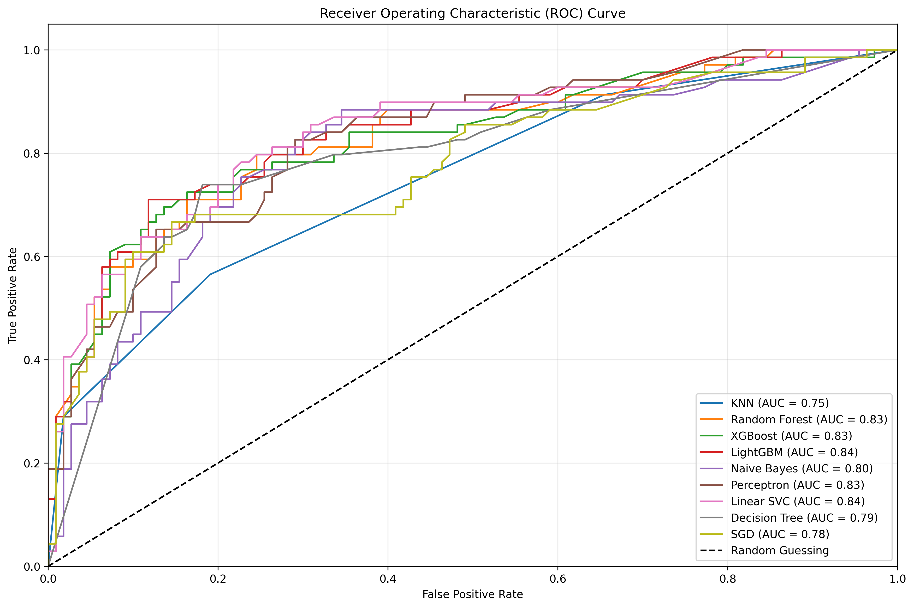

<h1 align="center">
  
  anonymized-data-Titanic
</h1>

<p align="center">
  Analiza wydajności modeli Machine Learning na danych Titanic: <strong>dane pierwotne</strong>, <strong>dane zaszumione</strong> oraz <strong>dane zanonimizowane metodą PRAM</strong>.
</p>

<p align="center">
  
  
  
  
  
</p>

---

<details open>
  <summary> <strong>Krótki opis projektu</strong> (kliknij, aby zwinąć / rozwinąć)</summary>

---

Projekt przedstawia porównanie skuteczności modeli klasyfikacyjnych na trzech wariantach danych Titanic. Punktem wyjścia są dane pierwotne po preprocessingu i feature engineeringu, następnie tworzony jest wariant z lekkim zaszumieniem wartości bucketowych oraz wariant zanonimizowany metodą PRAM (*Post Randomization Method*).

Głównym celem projektu jest sprawdzenie, jak kontrolowane modyfikacje danych wpływają na jakość predykcji oraz odporność modeli uczenia maszynowego. Projekt pokazuje praktyczny kompromis pomiędzy zachowaniem użyteczności danych a zwiększeniem poziomu prywatności i niepewności pojedynczych rekordów.

</details>

---

<details>
  <summary> <strong>Technologie i środowisko</strong> (kliknij, aby rozwinąć)</summary>

---

- **Język programowania:** [](https://www.python.org/)
- **Środowisko pracy:** [](https://jupyter.org/) [](https://code.visualstudio.com/) [](#)
- **System operacyjny:** [](https://ubuntu.com/) [](https://www.microsoft.com/windows)
- **Analiza danych:** [](https://pandas.pydata.org/) [](https://numpy.org/)
- **Wizualizacja:** [](https://matplotlib.org/) [](https://seaborn.pydata.org/)
- **Uczenie maszynowe:** [](https://scikit-learn.org/) [](https://xgboost.readthedocs.io/) [](https://lightgbm.readthedocs.io/)
- **Format danych:** [](#) [](#)

</details>

---

<details>
  <summary> <strong>Główne założenia projektu</strong> (kliknij, aby rozwinąć)</summary>

---

Projekt został przygotowany tak, aby:

- porównać modele ML na danych pierwotnych, zaszumionych i zanonimizowanych,
- sprawdzić wpływ modyfikacji danych na accuracy, precision, recall oraz F1-score,
- zastosować preprocessing danych Titanic i przekształcić dane do postaci numerycznej,
- utworzyć dodatkowe cechy, takie jak `Title`, `IsALone` oraz `Age*Class`,
- wprowadzić kontrolowane zaszumienie metodą przesuwania bucketów,
- zastosować metodę PRAM jako wariant anonimizacji oparty na prawdopodobieństwie,
- przygotować końcową predykcję w pliku `submission.csv`,
- zaprezentować wyniki w tabelach oraz na wykresie ROC.

</details>

---

<details>
  <summary> <strong>Cechy projektu</strong> (kliknij, aby rozwinąć)</summary>

---

- klasyfikacja binarna: `Survived = 0` lub `Survived = 1`,
- analiza danych tabelarycznych pochodzących ze zbioru Titanic,
- porównanie trzech wariantów danych w jednym eksperymencie,
- preprocessing braków danych i kodowanie zmiennych kategorycznych,
- feature engineering zwiększający wartość predykcyjną danych,
- kontrolowana modyfikacja zmiennych `Age` i `Fare`,
- porównanie modeli klasycznych, drzewiastych i boostingowych,
- ocena modeli na tym samym podziale train/validation,
- przygotowanie finalnego pliku predykcji `submission.csv`,
- graficzne podsumowanie wyników z wykorzystaniem krzywej ROC.

</details>

---

<details>
  <summary> <strong>Opis danych i zbioru użytego w projekcie</strong> (kliknij, aby rozwinąć)</summary>

---

Dane pochodzą z publicznego zbioru Titanic. Projekt korzysta z dwóch głównych plików wejściowych: `train.csv` oraz `test.csv`.

| Plik | Liczba rekordów | Liczba kolumn | Rola w projekcie |
|---|---:|---:|---|
| `train.csv` | 891 | 12 | Dane treningowe z kolumną docelową `Survived` |
| `test.csv` | 418 | 11 | Dane testowe bez kolumny `Survived`, użyte do predykcji końcowej |
| `submission.csv` | 418 | 2 | Wynik predykcji dla danych testowych |

**Najważniejsze kolumny oryginalnego zbioru:**

| Kolumna | Znaczenie |
|---|---|
| `PassengerId` | Identyfikator pasażera |
| `Survived` | Zmienna docelowa: `0` – nie przeżył, `1` – przeżył |
| `Pclass` | Klasa biletu pasażera: 1, 2 lub 3 |
| `Name` | Imię i nazwisko pasażera, wykorzystane do wydobycia tytułu |
| `Sex` | Płeć pasażera |
| `Age` | Wiek pasażera |
| `SibSp` | Liczba rodzeństwa lub małżonków na pokładzie |
| `Parch` | Liczba rodziców lub dzieci na pokładzie |
| `Ticket` | Numer biletu |
| `Fare` | Opłata za bilet |
| `Cabin` | Numer kabiny |
| `Embarked` | Port wejścia na pokład |

**Dane po przygotowaniu do modelu zostały sprowadzone do cech numerycznych:**

| Pclass | Sex | Age | Fare | Embarked | Title | IsALone | Age*Class |
|---:|---:|---:|---:|---:|---:|---:|---:|
| 3.0 | 0.0 | 5.0 | 0.0 | 2.0 | 1.0 | 1.0 | 15.0 |

Taka forma danych została wykorzystana do trenowania modeli, walidacji oraz porównania wariantów: danych czystych, zaszumionych i zanonimizowanych.

</details>

---

<details>
  <summary> <strong>Preprocessing i feature engineering</strong> (kliknij, aby rozwinąć)</summary>

---

W projekcie wykonano kilka etapów przygotowania danych, aby zbiór Titanic mógł zostać użyty przez modele uczenia maszynowego.

| Etap | Opis działania |
|---|---|
| Usunięcie wybranych kolumn | Usunięto m.in. `Ticket` i `Cabin`, ponieważ zawierały dużo braków lub słabszą wartość predykcyjną w tej wersji projektu |
| Utworzenie `Title` | Z kolumny `Name` wydobyto tytuły pasażerów, np. `Mr`, `Miss`, `Mrs`, `Master`, `Rare` |
| Kodowanie `Sex` | Płeć została zamieniona na wartości numeryczne: `male = 0`, `female = 1` |
| Uzupełnienie `Age` | Braki wieku uzupełniono medianą zależną od płci i klasy pasażera |
| Bucketowanie `Age` | Wiek został zamieniony na przedziały pięcioletnie |
| Utworzenie `IsALone` | Na podstawie `SibSp` i `Parch` określono, czy pasażer podróżował sam |
| Utworzenie `Age*Class` | Dodano cechę łączącą wiek i klasę pasażera |
| Kodowanie `Embarked` | Port wejścia na pokład został zakodowany jako wartość liczbowa |
| Bucketowanie `Fare` | Opłata za bilet została podzielona na 4 przedziały |
| Imputacja końcowa | Ewentualne braki uzupełniono średnią przy użyciu `SimpleImputer` |

</details>

---

<details>
  <summary> <strong>Opis metod anonimizacji i zaszumiania danych</strong> (kliknij, aby rozwinąć)</summary>

---

W projekcie porównano trzy warianty danych:

| Wariant danych | Opis | Rola w eksperymencie |
|---|---|---|
| `Clean Data` | Dane po preprocessingu bez dodatkowych modyfikacji | Punkt odniesienia dla pozostałych wariantów |
| `Moving Buckets` | Lekkie przesunięcie części wartości `Age` i `Fare` do sąsiednich bucketów | Zaszumienie danych przy możliwie małej utracie informacji |
| `PRAM` | Losowe przesunięcie wartości bucketów zgodnie z ustalonym prawdopodobieństwem | Silniejszy wariant anonimizacji i wprowadzenia niepewności |

**Moving Buckets – zaszumianie danych**

Metoda Moving Buckets polega na przesunięciu części wartości w kolumnach `Age` i `Fare` o jeden sąsiedni bucket. Zastosowano ją dla około `4%` rekordów w wybranych cechach. Dzięki temu pojedyncze wartości stają się mniej dokładne, ale ogólna struktura danych pozostaje bardzo podobna do danych pierwotnych.

```python
shift_fraction = 0.04
possible_shift = [-1, 1]
```

Po zmianie wieku ponownie przeliczana jest cecha pochodna `Age*Class`, aby zachować logiczną spójność danych.

**PRAM – Post Randomization Method**

PRAM to metoda perturbacyjna, w której wartości są losowo zmieniane zgodnie z ustalonym rozkładem prawdopodobieństwa. W tym projekcie metoda została zastosowana do bucketowych wersji `Age` i `Fare`.

| Przesunięcie bucketu | Prawdopodobieństwo |
|---:|---:|
| `-2` | 0.75% |
| `-1` | 1.50% |
| `0` | 95.50% |
| `+1` | 1.50% |
| `+2` | 0.75% |

```python
shifts = [-2, -1, 0, 1, 2]
probs = [0.0075, 0.015, 0.955, 0.015, 0.0075]
```

Większość wartości pozostaje bez zmian, ale część rekordów otrzymuje kontrolowaną modyfikację. Dzięki temu trudniej jest jednoznacznie odtworzyć oryginalną wartość konkretnego rekordu.

**Metody anonimizacji i zaszumiania omawiane w projekcie:**

| Metoda | Typ metody | Typ danych | Krótki opis |
|---|---|---|---|
| Global recoding | nieperturbacyjna | liczbowe / kategoryczne | Zmniejszenie szczegółowości danych przez grupowanie wartości |
| Top and bottom coding | nieperturbacyjna | liczbowe / kategoryczne | Ograniczanie wartości skrajnych do ustalonych progów |
| Local suppression | nieperturbacyjna | kategoryczne | Ukrywanie wybranych wartości podnoszących ryzyko identyfikacji |
| PRAM | perturbacyjna | kategoryczne / bucketowe | Losowa zmiana kategorii według macierzy prawdopodobieństw |
| Microaggregation | perturbacyjna | liczbowe | Grupowanie podobnych rekordów i zastępowanie wartości średnią lub medianą |
| Noise addition | perturbacyjna | liczbowe | Dodanie losowego szumu do wartości liczbowych |
| Shuffling | perturbacyjna | liczbowe | Przetasowanie wartości między rekordami |
| Rank swapping | perturbacyjna | liczbowe / porządkowe | Zamiana wartości między rekordami o podobnych rangach |

</details>

---

<details>
  <summary> <strong>Wykorzystane modele uczenia maszynowego</strong> (kliknij, aby rozwinąć)</summary>

---

W finalnym porównaniu wykorzystano 9 modeli klasyfikacyjnych:

- [](#)
- [](#)
- [](#)
- [](#)
- [](#)
- [](#)
- [](#)
- [](#)
- [](#)

Modele zostały porównane na tych samych cechach oraz na tym samym podziale walidacyjnym, dzięki czemu wyniki są bezpośrednio porównywalne.

</details>

---

<details>
  <summary> <strong>Specyfikacja eksperymentu</strong> (kliknij, aby rozwinąć)</summary>

---

| Element | Wartość |
|---|---|
| Typ zadania | Klasyfikacja binarna |
| Zmienna docelowa | `Survived` |
| Liczba rekordów treningowych | 891 |
| Liczba rekordów testowych | 418 |
| Liczba cech po preprocessingu | 8 |
| Cechy modelu | `Pclass`, `Sex`, `Age`, `Fare`, `Embarked`, `Title`, `IsALone`, `Age*Class` |
| Podział walidacyjny | 80% train / 20% validation |
| Liczba rekordów w treningu po podziale | 712 |
| Liczba rekordów w walidacji | 179 |
| `random_state` | 42 dla podziału i części modeli, 123 dla PRAM |
| Metryki | Accuracy, Precision, Recall, F1-score, Confusion Matrix, ROC/AUC |
| Wynik końcowy | `submission.csv` |

</details>

---

<details>
  <summary> <strong>Kroki podjęte w projekcie</strong> (kliknij, aby rozwinąć)</summary>

---



**Najważniejsze etapy:**

| Krok | Opis |
|---:|---|
| 1 | Wczytanie zbiorów `train.csv` i `test.csv` |
| 2 | Wstępna analiza danych, braków i typów zmiennych |
| 3 | Czyszczenie danych oraz usunięcie mniej użytecznych kolumn |
| 4 | Kodowanie zmiennych tekstowych do postaci liczbowej |
| 5 | Uzupełnianie braków w `Age`, `Fare` i `Embarked` |
| 6 | Utworzenie cech `Title`, `IsALone`, `Age*Class` |
| 7 | Podział danych na zbiór treningowy i walidacyjny |
| 8 | Utworzenie wariantu zaszumionego Moving Buckets |
| 9 | Utworzenie wariantu zanonimizowanego PRAM |
| 10 | Trenowanie i porównanie 9 modeli klasyfikacyjnych |
| 11 | Analiza wyników, tabel, metryk i krzywej ROC |
| 12 | Zapis końcowych predykcji do `submission.csv` |

</details>

---

<details>
  <summary> <strong>Wyniki i wizualizacje</strong> (kliknij, aby rozwinąć)</summary>

---

**Najlepszy model w każdym wariancie danych:**

| Wariant danych | Najlepszy model | Najlepsza dokładność walidacyjna | Średnia dokładność modeli | Średni F1-score dla klasy 1 |
|---|---|---:|---:|---:|
| Clean Data | LightGBM | 81.01% | 72.25% | 67.81% |
| Moving Buckets | LightGBM | 81.01% | 76.10% | 65.26% |
| PRAM | LightGBM | 78.77% | 75.42% | 67.23% |

**Porównanie dokładności walidacyjnej:**

| Model | Clean Data | Moving Buckets | PRAM |
|---|---:|---:|---:|
| LightGBM | 81.01% | 81.01% | 78.77% |
| XGBoost | 79.33% | 79.89% | 76.54% |
| Random Forest | 77.65% | 80.45% | 77.09% |
| Linear SVC | 77.65% | 77.65% | 77.65% |
| Decision Tree | 77.09% | 75.42% | 74.86% |
| Naive Bayes | 74.30% | 74.30% | 74.30% |
| KNN | 71.51% | 73.18% | 69.27% |
| Perceptron | 63.13% | 73.18% | 77.65% |
| SGD | 48.60% | 69.83% | 72.63% |

**Porównanie wyników treningowych:**

| Model | Clean Data | Moving Buckets | PRAM |
|---|---:|---:|---:|
| LightGBM | 89.19% | 90.17% | 89.47% |
| XGBoost | 90.45% | 91.01% | 91.01% |
| Random Forest | 90.87% | 91.43% | 91.29% |
| Linear SVC | 81.46% | 81.32% | 81.46% |
| Decision Tree | 90.87% | 91.43% | 91.29% |
| Naive Bayes | 77.53% | 77.95% | 77.81% |
| KNN | 86.24% | 87.92% | 86.24% |
| Perceptron | 62.78% | 78.51% | 80.62% |
| SGD | 49.16% | 74.30% | 74.86% |

**Wizualizacja ROC:**

<p align="center">
  
</p>

<p align="center">
  <em>Krzywa ROC przedstawia zdolność modeli do rozróżniania klas dla różnych progów decyzyjnych.</em>
</p>

**Alternatywna wersja wykresu z przezroczystym tłem:**

<p align="center">
  
</p>

</details>

---

<details>
  <summary> <strong>Wnioski z projektu</strong> (kliknij, aby rozwinąć)</summary>

---

Najlepsze i najbardziej stabilne wyniki osiągały przede wszystkim modele drzewiaste oraz boostingowe, szczególnie `LightGBM`, `XGBoost` i `Random Forest`. Dane pierwotne stanowiły punkt odniesienia, ale lekkie zaszumienie metodą Moving Buckets nie pogorszyło wyników w istotny sposób. W kilku przypadkach wyniki walidacyjne były nawet podobne lub lepsze niż dla danych czystych.

Metoda PRAM miała większy wpływ na dane, ponieważ wprowadzała silniejszą niepewność na poziomie pojedynczych rekordów. Wariant PRAM dawał lepszą ochronę prywatności niż zwykłe zaszumienie, ale częściej wiązał się ze spadkiem dokładności modeli. Najważniejszy wniosek jest taki, że zwiększanie prywatności danych zwykle wymaga kompromisu: im większa modyfikacja danych, tym większe ryzyko utraty części informacji predykcyjnej.

W tym projekcie Moving Buckets okazało się mniej inwazyjne i bardziej stabilne, natomiast PRAM lepiej pokazuje praktyczną cenę mocniejszej anonimizacji.

</details>

---

<details>
  <summary> <strong>Struktura repozytorium</strong> (kliknij, aby rozwinąć)</summary>

---

| Plik | Opis |
|---|---|
| `README.md` | Opis projektu, technologii, danych, metod, modeli i wyników |
| `test-jup.ipynb` | Główny notebook z kodem projektu |
| `train.csv` | Dane treningowe Titanic z kolumną `Survived` |
| `test.csv` | Dane testowe Titanic bez kolumny `Survived` |
| `submission.csv` | Plik z końcowymi predykcjami |
| `DokumentacjaMarcinWitnik_ProjektML_Titanic.docx` | Dokumentacja opisująca projekt, metody i wnioski |
| `roc_curve_ppt_16_9.png` | Wykres ROC w proporcjach dopasowanych do prezentacji |
| `roc_curve_transparent.png` | Wykres ROC z przezroczystym tłem |
| `LICENSE` | Licencja projektu |

</details>

---

<details>
  <summary> <strong>Uruchomienie projektu</strong> (kliknij, aby rozwinąć)</summary>

---

**1. Utworzenie środowiska wirtualnego:**

```bash
python -m venv .venv
```

**2. Aktywacja środowiska:**

Windows:

```bash
.venv\Scripts\activate
```

Linux / macOS:

```bash
source .venv/bin/activate
```

**3. Instalacja bibliotek:**

```bash
pip install pandas numpy matplotlib seaborn scikit-learn xgboost lightgbm jupyter
```

**4. Uruchomienie Jupyter Notebook:**

```bash
jupyter notebook
```

Następnie należy otworzyć plik `test-jup.ipynb` i uruchomić komórki notebooka od początku do końca.

</details>

---

<details>
  <summary> <strong>Licencja</strong> (kliknij, aby rozwinąć)</summary>

---

Projekt udostępniony jest na licencji MIT. Szczegóły znajdują się w pliku `LICENSE`.

</details>
